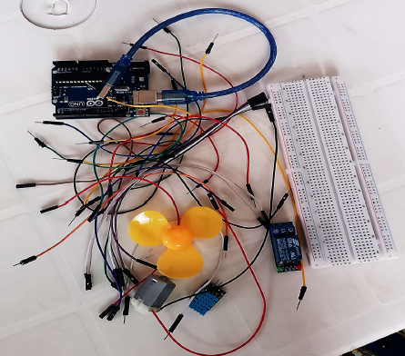
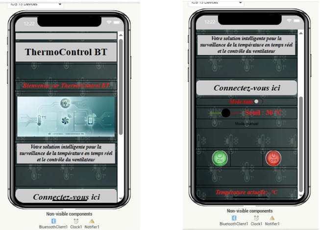
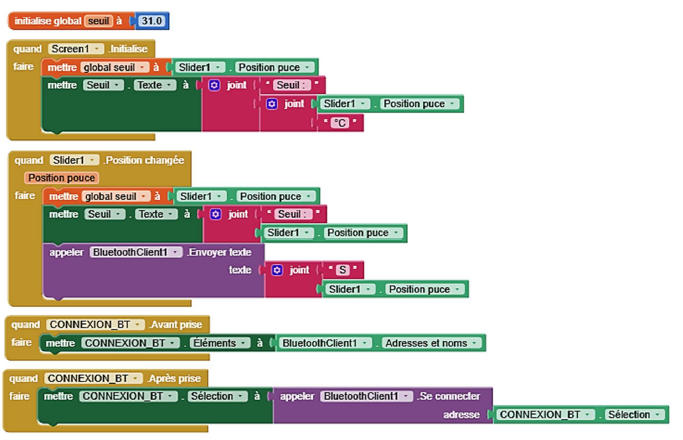
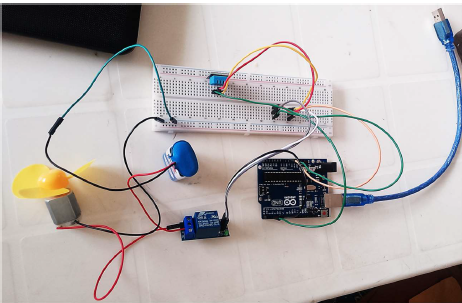
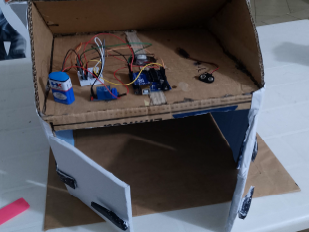
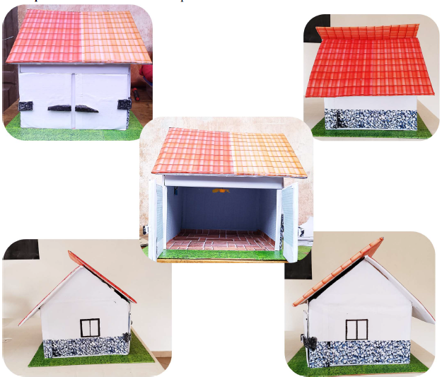

<div align="center">
  
  <br/><br/>
  <h1>RÉGULATEUR THERMIQUE CONNECTÉ</h1>
  <h3>Supervision en temps réel et commande manuelle du ventilateur via Bluetooth</h3>
  <p>
    <strong>Groupe n°5 (Smart Innovators) : FADONOUGBO Anselme · HOUNKOKOE Trifène · KINDOMISSI Achille</strong><br/>
    <em>Formation Professionnelle Max_Adis 2026 · Porto-Novo, Bénin</em>
  </p>
  <p>
    <a href="https://maxadis-thermo-control.vercel.app/" target="_blank"></a>
    <a href="assets/ThermoControl_BT.apk"></a>
  </p>
  <p>
    <a href="https://github.com/maxadis-formation/REGULATEUR-THERMIQUE-CONNECTE"></a>
    <a href="https://github.com/maxadis-formation/REGULATEUR-THERMIQUE-CONNECTE"></a>
    <a href="https://github.com/maxadis-formation/REGULATEUR-THERMIQUE-CONNECTE"></a>
    <a href="https://github.com/maxadis-formation/REGULATEUR-THERMIQUE-CONNECTE"></a>
    <a href="https://github.com/maxadis-formation/REGULATEUR-THERMIQUE-CONNECTE"></a>
  </p>
</div>

> 🌐 **Accéder au Site Web & Simulateur Interactif en Ligne :** [https://maxadis-thermo-control.vercel.app/](https://maxadis-thermo-control.vercel.app/)

<br/>

## 1. Présentation Générale du Projet

Avec les progrès de l'électronique et de l'Internet des Objets (IoT), il devient possible de surveiller et de contrôler différents équipements à distance. La régulation de la température est un besoin présent dans plusieurs domaines tels que les habitations, les salles informatiques, les entreprises, et les laboratoires.

Ce projet consiste à concevoir un système capable de mesurer la température ambiante grâce à un capteur **DHT11**, d'afficher cette température sur une application mobile via **Bluetooth HC-05** et de permettre la commande automatique ou manuelle d'un ventilateur. Le système est basé sur une carte **Arduino Uno** qui traite les informations du capteur et pilote un **relais 1 canal** commandant un ventilateur. Une application mobile développée avec **MIT App Inventor** permet à l'utilisateur de superviser la température en temps réel et d'allumer ou d'éteindre le ventilateur.

### Arborescence du Dépôt

```text
📁 REGULATEUR-THERMIQUE-CONNECTE/
├── 📁 assets/                 # Ressources multimédias, APK Android & photos
│   └── 📱 ThermoControl_BT.apk # Application mobile prête à installer (Android)
├── 📁 docs/                   # Rapport PDF officiel & cahier des charges
├── 📁 firmware/               # Code source embarqué Arduino (.ino)
├── 📄 .gitignore              # Fichiers ignorés standard
├── 📄 index.html              # Site web vitrine & simulateur interactif (déploiement Vercel)
├── 📄 robots.txt              # Directives d'indexation pour robots Google/Bing
├── 📄 sitemap.xml             # Plan de site XML pour indexation moteurs de recherche
└── 📄 README.md               # Documentation technique complète
```

---

## 2. Problématique du Projet

Dans de nombreux environnements, la température peut dépasser les limites acceptables et provoquer :
* Une diminution des performances des équipements ;
* Une surchauffe des composants électroniques ;
* Un inconfort des utilisateurs ;
* Des pertes matérielles.

Les systèmes classiques nécessitent souvent une intervention humaine permanente. 

> **Question principale :**  
> *« Comment réaliser un système simple, économique et connecté permettant de surveiller la température en temps réel et de commander facilement un ventilateur à distance ? »*

---

## 3. Objectifs du Projet

### Objectif Général
Concevoir un système de régulation thermique connecté permettant la supervision de la température et la commande manuelle d'un ventilateur.

### Objectifs Spécifiques
* Mesurer la température ambiante ;
* Afficher la température sur une application mobile ;
* Transmettre les données par Bluetooth ;
* Commander un ventilateur depuis un smartphone ;
* Assurer un fonctionnement fiable du système.

---

## 4. Fonctionnement du Système

Le système fonctionne selon les 9 étapes coordonnées suivantes :
1. Le capteur **DHT11** mesure la température ambiante.
2. La carte **Arduino Uno** récupère cette information.
3. La température est envoyée au module **Bluetooth HC-05**.
4. Le **smartphone** reçoit la température et l'affiche sur l'application en temps réel.
5. Lorsque l'utilisateur appuie sur le bouton **ON**, l'application envoie une commande Bluetooth.
6. L'Arduino reçoit cette commande.
7. L'Arduino active le **relais**.
8. Le relais alimente le **moteur à courant continu** qui entraîne l’hélice du ventilateur.
9. Lorsque l'utilisateur appuie sur **OFF**, le relais se désactive et le ventilateur s'arrête.

---

## 5. Liste des Matériels Utilisés et leur Rôle

| Matériel | Rôle & Fonction dans le Projet |
| :--- | :--- |
| **Arduino Uno** | Traite les données et commande l'ensemble du système. |
| **Capteur DHT11** | Mesure la température ambiante. |
| **Module Bluetooth HC-05** | Assure la communication entre l'Arduino et le smartphone. |
| **Module relais 1 canal** | Permet de commander le ventilateur sans surcharger l'Arduino (isolation). |
| **Ventilateur (hélice + moteur CC)** | Refroidit l'environnement lorsque l'utilisateur l'active. |
| **Breadboard** | Réalisation du montage sans soudure. |
| **Fils Jumpers** | Assurent les différentes connexions électriques. |
| **Alimentation** | Fournit l'énergie nécessaire au système. |
| **Câble USB Arduino** | Permet la programmation de l'Arduino et son alimentation depuis un ordinateur. |
| **Smartphone Android** | Sert d'interface de supervision et de commande. |

<div align="center">
  
</div>

---

## 6. Programmation & Code Source

* **Langage utilisé :** C/C++ (Arduino IDE)
* **Application mobile :** *ThermoControl BT* réalisée avec MIT App Inventor

### Code Source Arduino ([`firmware/CODE_FINAL.ino`](firmware/CODE_FINAL.ino))
Le programme utilise `millis()` (gestion du temps non-bloquante) au lieu de `delay(1000)` afin de garantir que l'Arduino reste réactif en permanence pour recevoir immédiatement les commandes Bluetooth `A` ou `B`.

```cpp
#include "DHT.h"
#include <SoftwareSerial.h>

SoftwareSerial mySerial(10, 11); // RX, TX vers HC-05
const int DHTPIN = 2;
const int DHTTYPE = DHT11;
const int pinRelais = 3;
DHT dht(DHTPIN, DHTTYPE);
bool modeAuto = false;
float seuil = 31.0;

unsigned long dernierEnvoi = 0;
const unsigned long intervalleEnvoi = 1000;

void setup() {
  pinMode(DHTPIN, INPUT);
  pinMode(pinRelais, OUTPUT);
  digitalWrite(pinRelais, HIGH); // Ventilateur éteint initialement
  dht.begin();
  Serial.begin(9600);
  mySerial.begin(9600);
}

void loop() {
  if (millis() - dernierEnvoi >= intervalleEnvoi) {
    float t = dht.readTemperature();
    if (!isnan(t)) {
      mySerial.println(t);
      Serial.print("Température actuelle: ");
      Serial.println(t);
      if (modeAuto) {
        if (t > seuil) digitalWrite(pinRelais, LOW);  // ON
        else digitalWrite(pinRelais, HIGH);          // OFF
      }
    }
    dernierEnvoi = millis();
  }

  if (mySerial.available()) {
    String commande = mySerial.readStringUntil('\n');
    commande.trim();
    if (commande == "M1") modeAuto = true;
    else if (commande == "M0") modeAuto = false;
    else if (commande.startsWith("S")) seuil = commande.substring(1).toFloat();
    else if (commande == "A" && !modeAuto) digitalWrite(pinRelais, LOW);  // Manuel ON
    else if (commande == "B" && !modeAuto) digitalWrite(pinRelais, HIGH); // Manuel OFF
  }
}
```

### Application Mobile & Blocs MIT App Inventor
<div align="center">
  <table border="0">
    <tr>
      <td align="center">
        
        <br/><strong>Interface ThermoControl BT</strong>
      </td>
      <td align="center">
        
        <br/><strong>Blocs logiques App Inventor</strong>
      </td>
    </tr>
  </table>
</div>

#### 📲 Téléchargement & Installation de l'Application Mobile (Android)
* **Fichier APK :** [**`assets/ThermoControl_BT.apk`**](assets/ThermoControl_BT.apk) (8.2 Mo)
* **Procédure d'installation :**
  1. Téléchargez le fichier `.apk` sur votre smartphone Android.
  2. Autorisez l'installation d'applications issues de sources inconnues si demandé.
  3. Activez le Bluetooth de votre téléphone et appairez-le au module **HC-05** (Code PIN par défaut : `1234` ou `0000`).
  4. Lancez **ThermoControl BT**, cliquez sur le sélecteur Bluetooth et choisissez le module **HC-05** pour démarrer la télémétrie en temps réel.

---

## 7. Cas d'Utilisation

* **Mode Automatique :** Le système détecte une chaleur excessive ($T > \text{seuil}$) et active le ventilateur sans intervention humaine.
* **Mode Manuel :** L'utilisateur constate un inconfort et décide d'activer le ventilateur manuellement via son application, même si la température est en dessous du seuil.
* **Cas 1 : Consultation de la température :** Ouverture de l'app, connexion au HC-05, affichage automatique.
* **Cas 2 : Mise en marche du ventilateur :** Appui sur ON (envoi commande `A`), activation relais, démarrage ventilateur.
* **Cas 3 : Arrêt du ventilateur :** Appui sur OFF (envoi commande `B`), désactivation relais, arrêt ventilateur.
* **Cas 4 : Surveillance continue :** La température continue d'être rafraîchie en continu chaque seconde.

---

## 8. Les 8 Étapes de Réalisation du Projet

1. **Étape 1 : Étude du besoin** (Constat, besoins identifiés, solution proposée).
2. **Étape 2 : Choix des composants** (Critères de sélection : coût, facilité de mise en œuvre, précision).
3. **Étape 3 : Montage sur breadboard** (Câblage prototype sans soudure).
4. **Étape 4 : Programmation de l'Arduino** (Développement C++ sous Arduino IDE).
5. **Étape 5 : Développement de l'application mobile** (Conception sous MIT App Inventor).
6. **Étape 6 : Tests du système et validation du fonctionnement** (6 tests validés avec succès).
7. **Étape 7 : Réalisation de la maquette** (Découpe, assemblage et intégration interne).
8. **Étape 8 : Présentation de la maquette finale** (Validation globale en conditions réelles).

<div align="center">
  <table border="0">
    <tr>
      <td align="center">
        
        <br/><strong>Étape 3 : Montage sur Breadboard</strong>
      </td>
      <td align="center">
        
        <br/><strong>Étape 7 : Assemblage de la Maquette</strong>
      </td>
    </tr>
  </table>
</div>

---

## 9. Tests du Système et Validation Fonctionnelle

| Test Réalisé | Description & Comportement Observé | Résultat |
| :--- | :--- | :--- |
| **Connexion Bluetooth** | L'application se connecte correctement au module HC-05 | **Validé** |
| **Réception de la température** | La valeur affichée correspond à la mesure réelle du DHT11 | **Validé** |
| **Réglage du seuil** | Le curseur modifie le seuil en temps réel sans redémarrer | **Validé** |
| **Mode automatique** | Le ventilateur s'active au dépassement du seuil, s'arrête en dessous | **Validé** |
| **Mode manuel** | Les boutons Marche/Arrêt commandent directement le ventilateur | **Validé** |
| **Sécurité des modes** | Une alerte s'affiche si une commande manuelle est tentée en auto | **Validé** |

---

## 10. Présentation de la Maquette Finale

<div align="center">
  
</div>

---

## 11. Conclusion, Difficultés et Perspectives

### Difficultés Rencontrées et Résolues
* Connexion Bluetooth entre le smartphone et le module HC-05 ;
* Synchronisation de l'affichage de la température sur l'application ;
* Alimentation du moteur CC ;
* Débogage du programme Arduino (gestion des temporisations non bloquantes) ;
* Tests de communication entre l'application et l'Arduino.

### Perspectives d'Évolution
* Automatiser complètement la mise en marche du ventilateur selon plusieurs profils thermiques ;
* Ajouter un écran LCD ou OLED local sur la maquette ;
* Remplacer le Bluetooth par le Wi-Fi (ESP32/ESP8266) pour permettre un contrôle à distance via Internet et Cloud ;
* Enregistrer l'historique des températures dans une base de données ;
* Envoyer des alertes push/SMS lorsque la température devient anormalement élevée.

---

## 12. Équipe du Projet & Mentions Légales

Projet réalisé par le **Groupe n°5 de la vague 1 (Smart Innovators)** :
* **FADONOUGBO Anselme**
* **HOUNKOKOE Trifène**
* **KINDOMISSI Achille**

* **Organisation & Mentorat :** Centre de formation **Max_Adis** (*« Crée et contrôle tes propres systèmes intelligents »*) — Édition 2026.
* **Lieu :** Porto-Novo, Bénin.

---

## 13. Contact, Support & Accompagnement de Projets

Vous souhaitez concevoir ou réaliser un projet similaire en **IoT, systèmes embarqués ou électronique** ? Vous avez besoin d'une assistance technique ou d'un accompagnement sur-mesure pour vos prototypes et formations ?

* **Email :** [maxadisorg@gmail.com](mailto:maxadisorg@gmail.com)
* **Téléphone / WhatsApp :** [+229 01 54 11 64 25](tel:+2290154116425)
* **Organisation GitHub :** [https://github.com/maxadis-formation](https://github.com/maxadis-formation)
* **Site Web Officiel & Démo Live :** [https://maxadis-thermo-control.vercel.app/](https://maxadis-thermo-control.vercel.app/)
* **Dépôt Officiel du Projet :** [https://github.com/maxadis-formation/REGULATEUR-THERMIQUE-CONNECTE](https://github.com/maxadis-formation/REGULATEUR-THERMIQUE-CONNECTE)

> *« Vos avis et retours comptent énormément ! N'hésitez pas à nous écrire pour toute suggestion d'amélioration ou collaboration. »*

